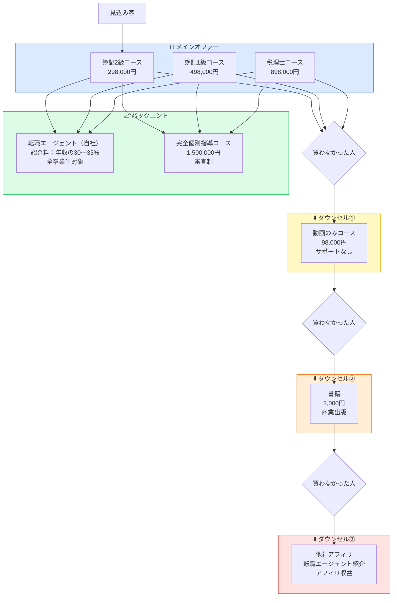

# 顧問塾 ビジネスモデル全体図

## 収益レイヤーまとめ

| レイヤー | 商品/施策 | 価格 | 収益タイプ |
|----------|-----------|------|-----------|
| メイン | 簿記2級コース | 298,000円 | 講座収益 |
| メイン | 簿記1級コース | 498,000円 | 講座収益 |
| メイン | 税理士コース | 898,000円 | 講座収益 |
| バックエンド① | 転職エージェント（自社） | 年収の30〜35% | 成功報酬 |
| バックエンド② | 完全個別指導コース | 1,500,000円 | 個別指導収益 |
| ダウンセル① | 動画のみコース | 98,000円 | 講座収益 |
| ダウンセル② | 書籍 | 3,000円 | 印税・認知 |
| ダウンセル③ | 他社アフィリ | - | アフィリ収益 |
